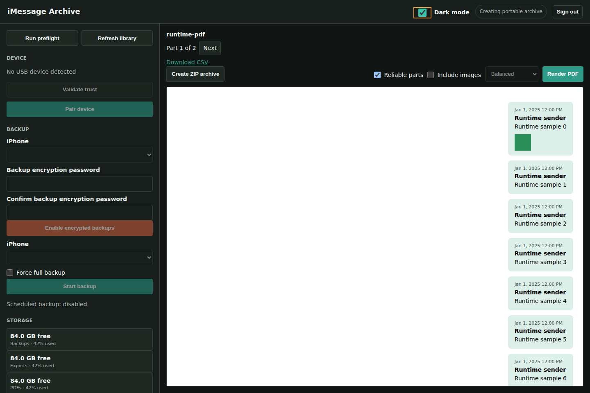

# Docker Compose on Unraid

The published-image Compose file installs without a local image build. Use Linux amd64 with Docker and Compose. USB backup needs a data-capable cable, an unlocked trusted iPhone, and access to `/dev/bus/usb`.

## Fresh installation

Download or clone this repository into `/mnt/cache/appdata/imessage-archive/build`. From the Unraid terminal:

```sh
cd /mnt/cache/appdata/imessage-archive/build
cp -n .env.example .env
chmod 600 .env
openssl rand -hex 32
nano .env
```

Set a unique `APP_PASSWORD`, and paste the random value into `FLASK_SECRET_KEY`. The sample values are placeholders, not usable security credentials. Keep `.env` private and do not commit it. Set `IMAGE=ghcr.io/crywolf203/imessage-archive:v4.0.1` to pin a release; omit `IMAGE` to track `latest`.

Review every host path in `docker-compose.image.yml`. The defaults use `/mnt/cache/appdata/imessage-archive/` for backups, configuration and pairing records, and `/mnt/user/iphone-message-archive/` for exports and PDFs. Configure that export share to stay on the array if cache capacity is limited; a `/mnt/user` path alone does not determine which disks Unraid uses.

```sh
docker compose -f docker-compose.image.yml config --quiet
docker compose -f docker-compose.image.yml pull
docker compose -f docker-compose.image.yml up -d --wait
docker compose -f docker-compose.image.yml ps
docker compose -f docker-compose.image.yml logs --tail=100
curl --fail http://127.0.0.1:8087/healthz
```

Open `http://YOUR-UNRAID-IP:8087`, sign in, pair the unlocked phone, run preflight, and start a backup. These commands must run in the build directory; running Compose from `root@Tower:~#` without `-f` will not find the file.

Use the image file consistently for `pull`, `up`, `logs` and `down`. `docker-compose.yml` instead builds the image from local source; it is not needed for normal installation. On a Linux host other than Unraid, replace the `/mnt/...` paths with private storage paths on that host. Windows Docker Desktop does not provide this Unraid/Linux USB workflow directly.

## Existing installations

Before updating, record the actual mounts:

```sh
docker inspect imessage-archive --format '{{range .Mounts}}{{println .Destination "->" .Source}}{{end}}'
```

Preserve `.env` and those paths in the new Compose file before recreating the container. Older exports/PDFs may live under `/mnt/cache/appdata/`; retain that mapping until a separate migration has been completed and checked. A mount change does not move files. A new template or Compose service must not run a second container against the same data folders, USB phone or pairing records.

Do not use `down --volumes` as an upgrade command. Do not delete backups to solve an image-update problem. The app's **Verify backup**, **Run diagnostics**, and **Refresh library** actions help check the preserved archive after upgrading.

## Automated proof

The [Verify published image workflow](https://github.com/crywolf203/imessage-archive/actions/workflows/verify-image.yml) runs the actual `docker-compose.image.yml` with a [CI-only override](../tests/compose.ci.yml). The override replaces every production mount with a disposable named volume, disables USB and scheduling, turns off privileged mode, and binds the UI only to the runner's loopback address.

It checks:

- Compose validation, anonymous image download, healthy startup and the HTTP service
- Authentication and a real browser sign-in with a disposable test account
- Indexing and search for 10,450 generated messages, with bounded conversation pages
- Real Chromium PDFs, including embedded images, HEIC-to-JPEG conversion, CSV and portable ZIP
- Browser conversation navigation, dark/light modes, mobile width and loaded image assets

Each successful run uploads `compose-runtime-proof` with timing results and desktop/mobile screenshots. All messages and images in these artifacts are synthetic. This proves the Compose app stack, not physical iPhone pairing, a real backup or Wi-Fi discovery: those still require an Unraid device test.

The [October 4, 2026 Compose run](https://github.com/crywolf203/imessage-archive/actions/runs/37193181697) passed using app source `c885d20`. It indexed 10,450 synthetic messages in 1.421 seconds; the indexed search page returned in 0.051 seconds; a 450-message PDF took 2.918 seconds without images and 2.897 seconds with three tiny generated images. These GitHub-runner measurements are not an ETA for a real photo-heavy iPhone archive.



[Light-mode screenshot](screenshots/desktop-light.png) and [mobile screenshot](screenshots/mobile.png) were captured by the same browser test.

The CI override requires Compose 2.24.4 or newer because it uses `!override` and `!reset`. It is not an installation template and must never be used with your personal data.

## USB and security

The production Compose file uses privileged mode and a USB bus mount for hotplug. Privileged mode grants broad host access, so use this only on a trusted server. Only one `usbmuxd` service should own the phone. A charging-only cable will not expose a device. Unlock the iPhone and enter its passcode when iOS requests it.

Keep port 8087 on a private LAN or behind a VPN/authenticated HTTPS proxy. Keep backup, export, configuration and pairing folders out of public SMB shares. Backup encryption does not encrypt HTML, text, CSV, ZIP or PDF outputs. CPU/image processing and disk I/O dominate PDF work; passing through a GPU is not required.
